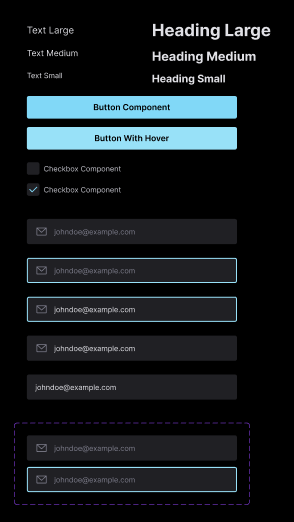

# Ignite Lab: Desing System

Um projeto desenvolvido por [mim](https://github.com/SheilaNS) durante o curso Ignite Lab da [Rocketseat](https://www.rocketseat.com.br/). 
Ministrado pelo [Diego Fernandes](https://github.com/diego3g), CTO da Rocketseat. 
Nele eu aprendi como montar uma página de login do [Figma](https://www.figma.com/) ao [React](https://pt-br.reactjs.org/) criando um Desing System do zero.  
URL do projeto: https://sheilans.github.io/ignite-lab-desing-system/

### Stacks utilizadas
- TypeScript
- React.js
- Tailwind

 
 

